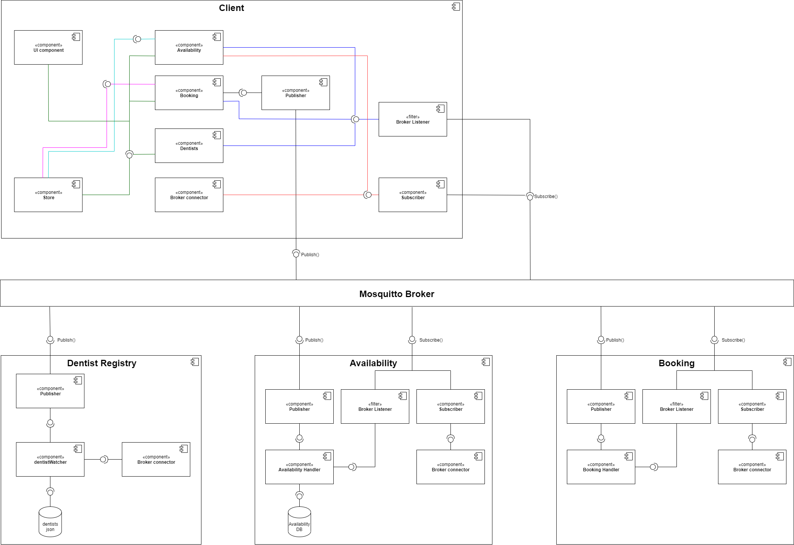

# Documentation

# WHAT
The aim of this system is to provide end-users with an interface to book dentist appointments in Gothenburg. For convenient use the dentist clinics are displayed on a map that the user can navigate. The system is built distributed with publish-subscribe as the main architectural style. 

# WHY
The current system for booking dental appointments in Sweden is currently very unpolished, and everyone who’s trying to get appointments are usually faced with fully booked dentists clinics. Currently to be able to find an available time, you’d have to do a lot of time-consuming, manual labor in the manner of browsing different websites, making many phone calls, often leading to unsuccessful attempts to book appointments.

# HOW
The system will make use of a map API in order to display all existing dentist clinics in the Gothenburg area to the user. The user will be able to navigate the map, choose a clinic, and see the available appointment time slots for a date. The user will then be able to book a time slot, and the system will process the request.

# Project Setup
[Project Setup](./setup.md)

# Software Requirements Specification
[SRS](/requirements/requirements-V1.md)

# Software Architecture
## Architecture
- Distributed system
- Publish Subscribe using a Broker for middleware 
## Architectural Drivers

## Use Case Diagram

## Component Diagram

## Deployment Diagram

# UI Prototype
[Prototype](https://www.figma.com/file/3xZO3wUXbr0LrK8UovMUED/Distribueno-alpha-v1?node-id=0%3A1)

# Technical Overview 
## Software: 
- JavaScript ES6
- [Npm](https://www.npmjs.com)
- [Vue.js](https://vuejs.org) 
- [Vuex State management](https://vuex.vuejs.org) 
- [Vue Test Utils with Jest](https://vue-test-utils.vuejs.org) 
- [BootstrapVue](https://bootstrap-vue.org)
- [Eclipse Mosquitto](https://mosquitto.org)
- [Leaflet JS](https://leafletjs.com) 
- [MQTT.js](https://github.com/mqttjs/MQTT.js)
- [Figma](https://www.figma.com)
## Project Management: 
- [Trello](https://trello.com/b/oPfPY7yK/dit-355-2020-team-2)		
- [Google Drive](https://drive.google.com/drive/folders/1TaH2hneIUDwb7-DeefhaFK1FYkCDtH6U?usp=sharing)
- [Diagrams.net](https://app.diagrams.net)

# Development Process 
## Agile - Sprints
The system will be developed using agile development methodology and Sprints. The planning schedule is as follows:
The development period is set to be  between 2020/11/16 and 2020/12/21 with initial planning period between 2020/11/02 and 2020/11/15.
The team uses Google drive for documentation as well as Trello for task management. Draw io is used for designing the architecture diagrams.

Guidelines team members are adhering to during the project:
[Trello Guidelines](https://git.chalmers.se/courses/dit355/2020/group-2/documentation/-/blob/master/TrelloGuidelines.md)

# Team Overview
## Team members
- Johann Tammen
- Sandra Smoler Eisenberg
- Eemil Jeskanen
- Krasen Antoliev Parvanov
- Chrysostomos Tsagkidis
- Samuel Gunnarsson

[Roles](https://git.chalmers.se/courses/dit355/2020/group-2/documentation/-/blob/master/Roles.md)

