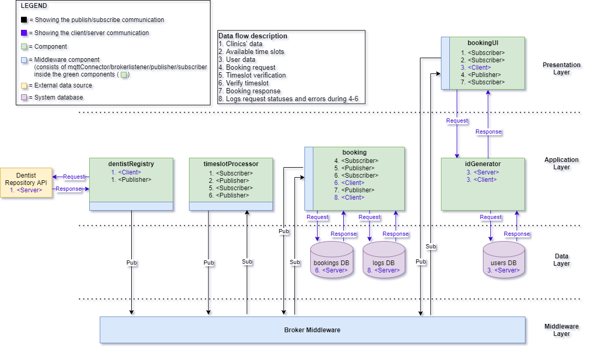
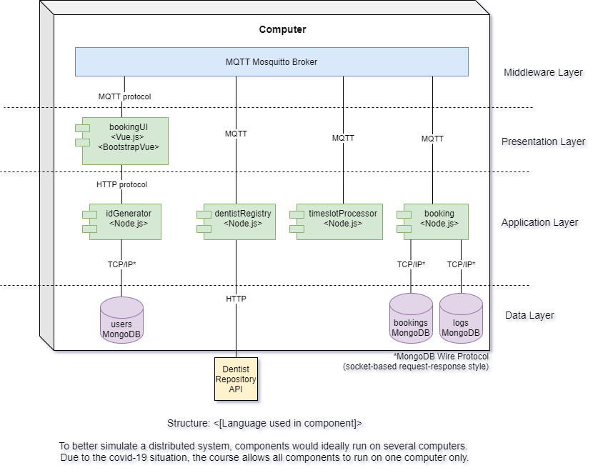
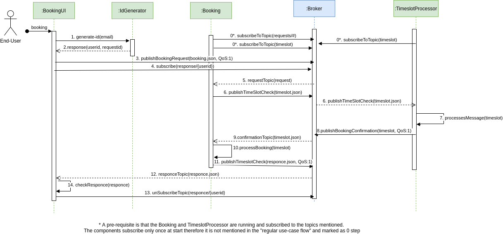
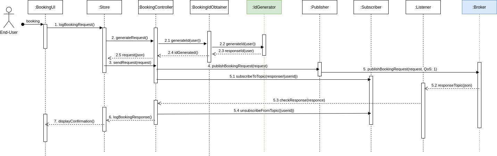
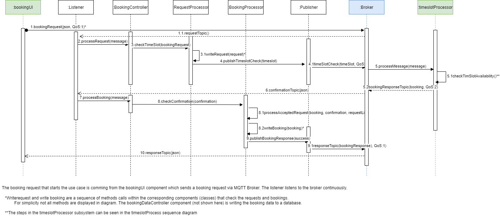
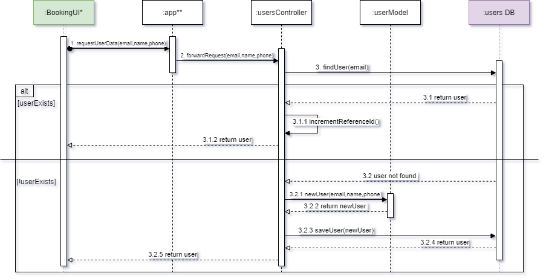

# Dentistimo Documentation

# WHAT
The aim of this system is to provide end-users with an interface to book dentist appointments in Gothenburg. For convenient use the dentist clinics are displayed on a map that the user can navigate. The system is built distributed with publish-subscribe as the main architectural style. 

# WHY
The current system for booking dental appointments in Sweden is currently very unpolished, and everyone who’s trying to get appointments are usually faced with fully booked dentists clinics. Currently to be able to find an available time, you’d have to do a lot of time-consuming, manual labor in the manner of browsing different websites, making many phone calls, often leading to unsuccessful attempts to book appointments.

# HOW
The system will make use of a map API in order to display all existing dentist clinics in the Gothenburg area to the user. The user will be able to navigate the map, choose a clinic, and see the available appointment time slots for a date. The user will then be able to book a time slot, and the system will process the request.

# Project Setup
[Project Setup](./setup.md)

# Software Requirements Specification
[SRS](/requirements/requirements-V2.md)

# Software Architecture
## Architecture overview

The system is designed as a distributed system where every component/subsystem acts as an independent node. The main architectural style used for communication and data transfer between components is publish-subscribe. The client subscribes and listens to the a MQTT broker for different topics, but can publish as well (e.g. whilst creating the booking requests).
<br><br>
The BookingUI uses a client-server architectural style for communicating with the idGenerator component. The BookingUI requests userId and requestId while the idGenerator has the responsibility to issue and maintain the user/request information. Furthermore, the dentistRegistry takes advantage of the client-server architectural style in order to continuously retrieve the clinics' information from the external dentist registry API by using an HTTP request. [2020-12-14]
<br><br>
The team designed a broker listener component that receives all incoming messages from the broker and filters them to the corresponding handlers and controllers following simple separation of concerns and GRASP design principles. The BookingUI also uses Model-view-viewmodel (MVVM) style in order to optimize the use of Vue.js and Vuex frontend framework functionality, especially the reactivity. Moreover, using this framework and the MVVM pattern allows for further decoupling between the business logic and UI components. The components on the backend are also using publish-subscribe pattern to communicate with each other, while the messages are processed by listeners and controllers to handle the availability filtering of opening hours and booking requests as well as handling the booking.

### Architecture styles

- Publish-subscribe: between the components and the corresponding subsystems
- Client-server: Used to integrate the external dentist registry API by using HTTP request. Also used between the idGenerator(server) and BookingUI(client) by using RPC API [2020-12-14]

### Design patterns and principles

- Model-view-viewmodel (MVVM): used in the frontend UI components with Vuejs framework and Vuex
- GRASP and SOLID principles for low level class design for the business logic part, especially single-responsibility and separation of concerns.

### Architectural Drivers

Main architectural driver taken into consideration when designing the system and choosing architectural styles are:

- Scalability: since a distributed, decoupled system well allows us to scale the different components when needed to adapt to the incoming request. Since the components can run on separate nodes we can scale the different components at different times.
- Maintainability: since the components are decoupled that will allow us to maintain them easier, for example different teams can maintain different components. That will increase the reusability of the components and their modifiability.
- Portability: Since the components are independent and use a MQTT broker to communicate they can be deployed on different nodes and easily be replaced with other logical units since the communication happens only through a common interface and the components are logically decoupled.


## Component Diagram [last updated: 2020-12-16]

### Components 
Further information about the individual components with their low-level component diagrams as well as the source-code can be found at:
 
[bookingUI](https://git.chalmers.se/courses/dit355/2020/group-2/client)  
[dentistRegistry](https://git.chalmers.se/courses/dit355/2020/group-2/dentistregistry)  
[timeslotProcessor](https://git.chalmers.se/courses/dit355/2020/group-2/availability)  
[booking](https://git.chalmers.se/courses/dit355/2020/group-2/booking)  
[idGenerator](https://git.chalmers.se/courses/dit355/2020/group-2/idgenerator) 

For load and stress testing an additional component was introduced and the source code can be found at: 
[requestGenerator](https://git.chalmers.se/courses/dit355/2020/group-2/requestgenerator) 


## Deployment Diagram [last updated: 2020-12-17]

## Use Case Diagram

## Sequence Diagrams

### Sequence Diagram for Use Case: Make a booking

#### Description
The diagram represents a high-level sequence and actions needed to make a booking as well as the corresponding components involved. The diagram displays only the subsystems involved in making a booking request for simplicity. The steps/sequences and components involved in performing the use case for every single subsystem can be seen in specific use case diagrams for those components. A pre-requisite for this use case is assumed that the UI component has received and displayed the dentist's time slots and that the user has selected a time, date and a clinic and the user has provided the needed data in the booking form. The use case starts the moment the user confirms the booking in the UI booking form.



### BookingUI Subsystem Sequence Diagram for Use Case: Make a booking

#### Description
The diagram represents the sequence and actions needed to make a booking as well as the corresponding components involved. The diagram focuses on the BookingUI component/subsystem and the system communication with the booking subsystem which is represented only as a component for simplicity. The steps between the bookingRequest and booking Confirmation can be seen in the diagrams for the Booking subsystem and Availablitilty subsystem.



### Booking Subsystem sequence diagram Use Case: Make a booking

#### Description
The diagram represents the sequence and actions needed to make a booking as well as the corresponding components involved. The diagram takes into consideration only the Booking subsystem/component and TimeslotProcessor and bookingUI subsystem which are represented as components for simplicity, The steps needed prior to this use case can be seen in the bookingUI sequence diagram. The steps between 5.processMessage and 5.2bookingResponseTopic can be seen in the TimeslotProcessor Sequence diagram. Furthermore, the steps after 10.responseTopic can be seen in the bookingUI subsystem diagram.



### Availability Subsystem sequence diagram Use Case: Make a booking

#### Description
The diagram represents the sequence and actions needed to make a booking as well as the corresponding components involved. The diagram takes into consideration only the Availability subsystem/component and the system communication with the Booking. The steps needed prior to this use case can be seen in the Booking sequence diagram. The steps after confirmation can be seen in the Booking subsystem diagram


### idGenerator Subsystem sequence diagram Use Case: Make a booking [last updated 2020-12-18]

#### Description
The diagram represents the sequence and actions needed in the idGenerator component in order to make a booking. The diagram takes into consideration only the idGenerator subsystem/component and the system communication with the bookingUI. The steps needed prior to this use case can be seen in the bookingUI sequence diagram, along with the steps following this sequence diagram.<br>
*The steps in the bookingUI subsystem can be seen in the bookingUI sequence diagram. <br>
**A prerequisite is that the app is listening to a port and connected to the mongoDB database.



# UI Prototype
[Prototype](https://www.figma.com/file/3xZO3wUXbr0LrK8UovMUED/Distribueno-alpha-v1?node-id=0%3A1)

# Technical Overview 

## Fault tolerance

The main use case that the team has identified by taking in consideration both the project's requirements and constrains is creating a booking to one of the available dentist clinics. Consequently, the component that shall act as the main entry point in order to process, forward and respond the corresponding requests is the [Booking](https://git.chalmers.se/courses/dit355/2020/group-2/booking). Therefore, as far as introducing a fault-tolerance mechanism is concerned, a request rate limiter has been implemented as part of the booking component. <br>
Specifically, whenever the number of incoming requests exceeds the rate of 100 booking requests in 10 seconds then the rate limiter denies any new ones, hence preventing the system from experiencing any downtime due to any possible Denial of Service attacks. In the event that the incoming requests return to the normal rate (less or equal to 100reqs/s) then they should be accepted from system and therefore returning to the previous normal operating state. <br>
Ultimately, as a way to visualize the rate limiter's functionality, the incoming requests are both logged in the backend's running server console as well as in the component's database (MongoDB). Below you can see an indicative example of recorded console messages for both an accepted and a denied request:

```
2020-12-17T00:00:00.000Z [Accepted] info: Request id: 41 User id: uuid-176704a278061b8b1 Dentist id: 1
2020-12-17T00:00:00.000Z [Denied] warn: Request id: 57 User id: uuid-176704a278471268f Dentist id: 1
```

## Quality of service
The number in the parentheses refers to the number of the data-flow number of the component-diagram.

- (1) Publish clinics data
  - Qos: 1
  - Reasoning: The requirement is that changes to the dentist registry must be handled by the system in less than 10 minutes. Therefore, the system makes sure when a change occurs it is at least published once. Multiple publications don't effect the system too much since, other components compare the incoming dentist files to the current one and only update when it differs.
- (2) Publish available timeslots
  - Qos: 1
  - Reasoning: Publishing the availability of timeslots for a clinic is quite important for making a booking, but it gets updated frequently. Therefore, the team has chosen a qos of 1 to increase the likelihood that the message gets received without the overhead of a qos 2. 
- (2x) Publish availability per date
  - Qos: 0
  - Reasoning: This type of data is not crucial for the main use case of making a booking, and it is a lot of data. Even a qos of 1 would lead to massive traffic, therefore the team decided to send this data at most once.
- (4) Booking request
  - Qos: 1
  - Reasoning: By publishing this kind of data, other components get triggered to process a booking. Therefore, the initial plan was to use qos: 2, to make sure the processing methods only get triggered once. However, by the overhead of making sure a message is only received once, the speed of the system decreased so much, that it was not satisfying to use anymore. Hence, the team decreased the qos to 1, because even when some methods get triggered twice, the speed for making a booking increased by a big margin.
- (5) Timeslot verification request
  - Qos: 1
  - Reasoning: By publishing this kind of data, other components get triggered to process a booking. Therefore, the initial plan was to use qos: 2, to make sure the processing methods only get triggered once. However, by the overhead of making sure a message is only received once, the speed of the system decreased so much, that it was not satisfying to use anymore. Hence, the team decreased the qos to 1, because even when some methods get triggered twice, the speed for making a booking increased by a big margin.
- (6) Timeslot verification response
  - Qos: 1
  - Reasoning: By publishing this kind of data, other components get triggered to process a booking. Therefore, the initial plan was to use qos: 2, to make sure the processing methods only get triggered once. However, by the overhead of making sure a message is only received once, the speed of the system decreased so much, that it was not satisfying to use anymore. Hence, the team decreased the qos to 1, because even when some methods get triggered twice, the speed for making a booking increased by a big margin.
- (7) Booking response
  - Qos: 1
  - Reasoning: By publishing this kind of data, other components get triggered to process a booking. Therefore, the initial plan was to use qos: 2, to make sure the processing methods only get triggered once. However, by the overhead of making sure a message is only received once, the speed of the system decreased so much, that it was not satisfying to use anymore. Hence, the team decreased the qos to 1, because even when some methods get triggered twice, the speed for making a booking increased by a big margin.

## Software: 
- JavaScript ES6
- [Npm](https://www.npmjs.com)
- [Lodash](https://lodash.com)
- [Vue.js](https://vuejs.org) 
- [Vuex State management](https://vuex.vuejs.org) 
- [Vue Test Utils with Jest](https://vue-test-utils.vuejs.org) 
- [BootstrapVue](https://bootstrap-vue.org)
- [Eclipse Mosquitto](https://mosquitto.org)
- [Leaflet JS](https://leafletjs.com) 
- [MQTT.js](https://github.com/mqttjs/MQTT.js)
- [Figma](https://www.figma.com)
- [Expressjs](https://expressjs.com)
- [Mongoosejs](https://mongoosejs.com)
- [Axios](https://www.npmjs.com/package/axios)
- [Winston](https://www.npmjs.com/package/winston)
- [Winston-Mongodb](https://www.npmjs.com/package/winston-mongodb)
- [Limiter](https://www.npmjs.com/package/limiter)

## Project Management: 
- [Trello](https://trello.com/b/oPfPY7yK/dit-355-2020-team-2)		
- [Google Drive](https://drive.google.com/drive/folders/1TaH2hneIUDwb7-DeefhaFK1FYkCDtH6U?usp=sharing)
- [Diagrams.net](https://app.diagrams.net)

# Development Process 
## Agile - Sprints
The system will be developed using agile development methodology and Sprints. The planning schedule is as follows:
The development period is set to be  between 2020/11/16 and 2020/12/21 with initial planning period between 2020/11/02 and 2020/11/15.
The team uses Google drive for documentation as well as Trello for task management. Draw io is used for designing the architecture diagrams.

Guidelines team members are adhering to during the project:
[Trello Guidelines](https://git.chalmers.se/courses/dit355/2020/group-2/documentation/-/blob/master/TrelloGuidelines.md)

# Team Overview
## Team members
- Johann Tammen
- Sandra Smoler Eisenberg
- Eemil Jeskanen
- Krasen Antoliev Parvanov
- Chrysostomos Tsagkidis
- Samuel Gunnarsson

[Roles](./roles.md)

