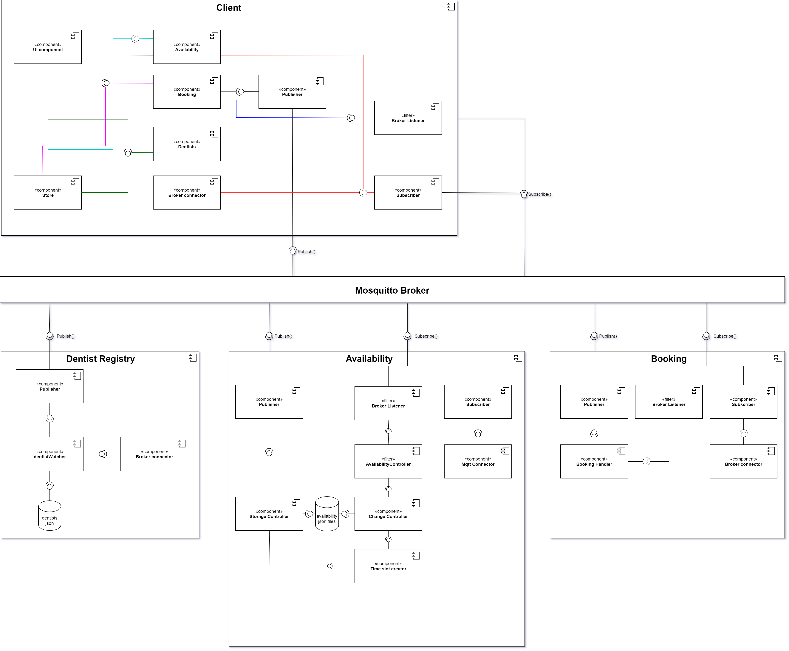
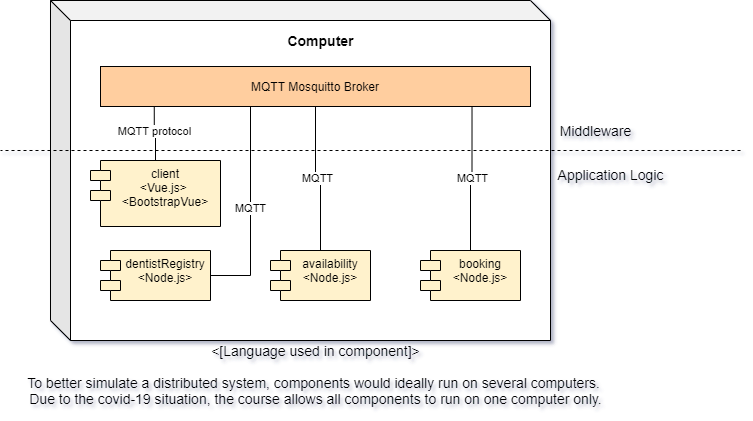
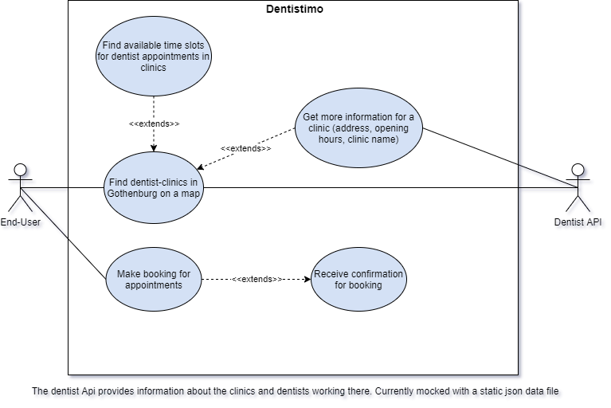
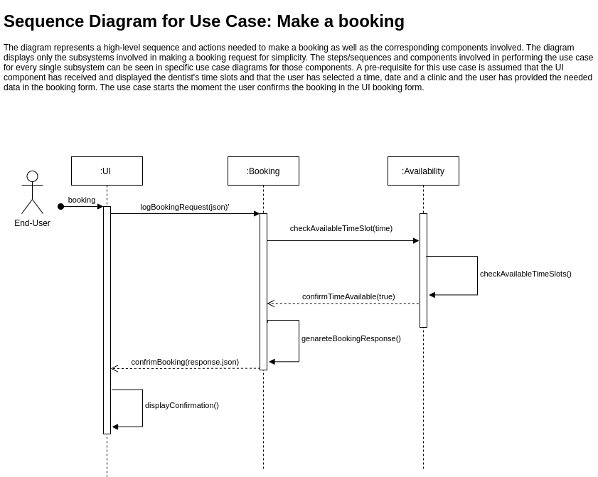
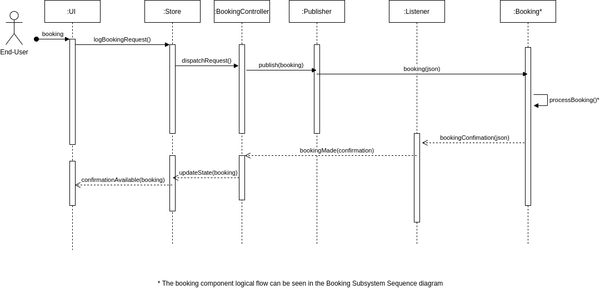
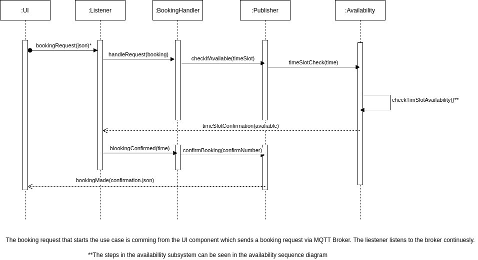
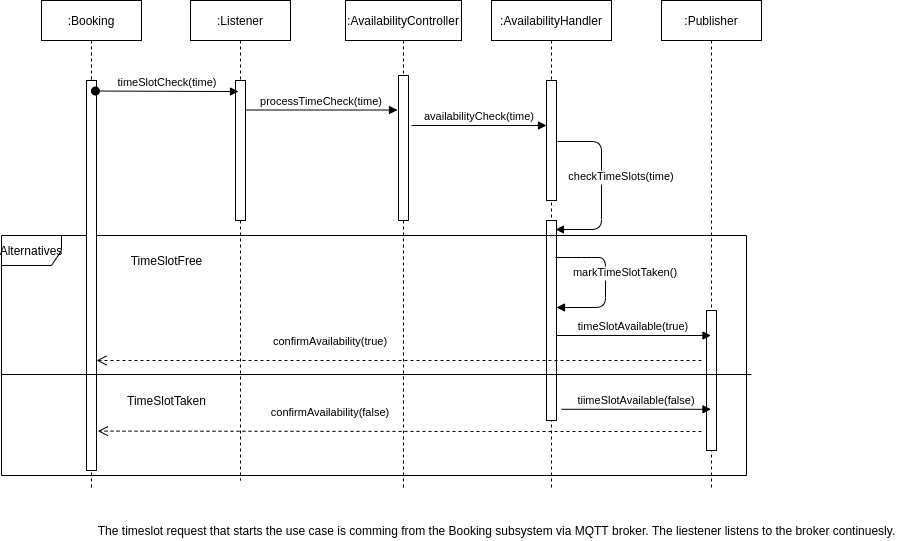

# Documentation

# WHAT
The aim of this system is to provide end-users with an interface to book dentist appointments in Gothenburg. For convenient use the dentist clinics are displayed on a map that the user can navigate. The system is built distributed with publish-subscribe as the main architectural style. 

# WHY
The current system for booking dental appointments in Sweden is currently very unpolished, and everyone who’s trying to get appointments are usually faced with fully booked dentists clinics. Currently to be able to find an available time, you’d have to do a lot of time-consuming, manual labor in the manner of browsing different websites, making many phone calls, often leading to unsuccessful attempts to book appointments.

# HOW
The system will make use of a map API in order to display all existing dentist clinics in the Gothenburg area to the user. The user will be able to navigate the map, choose a clinic, and see the available appointment time slots for a date. The user will then be able to book a time slot, and the system will process the request.

# Project Setup
[Project Setup](./setup.md)

# Software Requirements Specification
[SRS](/requirements/requirements-V1.md)

# Software Architecture
## Architecture overview

The system is designed as a distributed system where every component/subsystem acts as an independent node. The main architectural style used for communication and data transfer between components is publish-subscribe. The client subscribes and listens to the a MQTT broker for different topics, but can publish as well (e.g. whilist creating the booking requests). The client uses a pipe-filter architecture style for filtering the incoming messages from the broker. The team designed a broker listener component that receives all incoming messages from the broker and filters them to the corresponding handlers and controllers following simple separation of concerns and GRASP design principles. The client also uses Model-view-viewmodel (MVVM) style in order to optimize the use of Vue.js and Vuex frontend framework functionality, especially the reactivity. Moreover, using this framework and the MVVM pattern allows for further decoupling between the business logic and UI components. The components on the backend are also using publish-subscribe pattern to communicate with each other, while taking advantages of the pipe-filter to handle the availability filtering of opening hours and booking requests as well as handling the booking.

### Architectural styles

- Publish-subscribe: between the components and the corresponding subsystems
- Pipe and filter: used in component level to filter and process the messages and also being able to handle all the different incoming requests 
- Model-view-viewmodel (MVVM): used in the frontend UI components with Vuejs framework and Vuex
- GRASP and SOLID principles for low level class design for the business logic part, especially single-responsibility and separation of concerns.

## Architectural Drivers

Main architectural driver taken into consideration when designing the system and choosing architectural styles are:

- Scalability: since a distributed, decoupled system well allows us to scale the different components when needed to adapt to the incoming request. Since the components can run on separate nodes we can scale the different components at different times.
- Maintainability:: since the components are decoupled that will allow us to maintain them easier, for example different teams can maintain different components. That will increase the reusability of the components and their modifiability.
- Portability: Since the components are independent and use a MQTT broker to communicate they can be deployed on different nodes and easily be replaced with other logical units since the communication happens only through a common interface and the components are logically decoupled.

## Component Diagram

## Deployment Diagram

## Use Case Diagram

## Sequence Diagrams

### Sequence Diagram for Use Case: Make a booking

#### Description
The diagram represents a high-level sequence and actions needed to make a booking as well as the corresponding components involved. The diagram displays only the subsystems involved in making a booking request for simplicity. The steps/sequences and components involved in performing the use case for every single subsystem can be seen in specific use case diagrams for those components. A pre-requisite for this use case is assumed that the UI component has received and displayed the dentist's time slots and that the user has selected a time, date and a clinic and the user has provided the needed data in the booking form. The use case starts the moment the user confirms the booking in the UI booking form.

### UI/Client Subsystem Sequence Diagram for Use Case: Make a booking

#### Description
The diagram represents the sequence and actions needed to make a booking as well as the corresponding components involved. The diagram focuses on the UI component/subsystem and the system communication with the booking subsystem which is represented only as a component for simplicity. The steps between the bookingRequest and booking Confirmation can be seen in the diagrams for the Booking subsystem and Availablitilty subsystem.

### Booking Subsystem sequence diagram Use Case: Make a booking

#### Description
The diagram represents the sequence and actions needed to make a booking as well as the corresponding components involved. The diagram takes into consideration only the Booking subsystem/component and Availability and UI subsystem which are represented as components for simplisity, The steps needed prior to this use case can be seen in the UI sequence diagram. The steps between timeSlotsCheck and timeSlotConfirmation can be seen in the Availability Sequence diagram. Furthermore, the steps after confirmation can be seen in the UI subsystem diagram

### Availability Subsystem sequence diagram Use Case: Make a booking

#### Description
The diagram represents the sequence and actions needed to make a booking as well as the corresponding components involved. The diagram takes into consideration only the Availability subsystem/component and the system communication with the Booking. The steps needed prior to this use case can be seen in the Booking sequence diagram. The steps after confirmation can be seen in the Booking subsystem diagram

# UI Prototype
[Prototype](https://www.figma.com/file/3xZO3wUXbr0LrK8UovMUED/Distribueno-alpha-v1?node-id=0%3A1)

# Technical Overview 
## Software: 
- JavaScript ES6
- [Npm](https://www.npmjs.com)
- [Vue.js](https://vuejs.org) 
- [Vuex State management](https://vuex.vuejs.org) 
- [Vue Test Utils with Jest](https://vue-test-utils.vuejs.org) 
- [BootstrapVue](https://bootstrap-vue.org)
- [Eclipse Mosquitto](https://mosquitto.org)
- [Leaflet JS](https://leafletjs.com) 
- [MQTT.js](https://github.com/mqttjs/MQTT.js)
- [Figma](https://www.figma.com)
## Project Management: 
- [Trello](https://trello.com/b/oPfPY7yK/dit-355-2020-team-2)		
- [Google Drive](https://drive.google.com/drive/folders/1TaH2hneIUDwb7-DeefhaFK1FYkCDtH6U?usp=sharing)
- [Diagrams.net](https://app.diagrams.net)

# Development Process 
## Agile - Sprints
The system will be developed using agile development methodology and Sprints. The planning schedule is as follows:
The development period is set to be  between 2020/11/16 and 2020/12/21 with initial planning period between 2020/11/02 and 2020/11/15.
The team uses Google drive for documentation as well as Trello for task management. Draw io is used for designing the architecture diagrams.

Guidelines team members are adhering to during the project:
[Trello Guidelines](https://git.chalmers.se/courses/dit355/2020/group-2/documentation/-/blob/master/TrelloGuidelines.md)

# Team Overview
## Team members
- Johann Tammen
- Sandra Smoler Eisenberg
- Eemil Jeskanen
- Krasen Antoliev Parvanov
- Chrysostomos Tsagkidis
- Samuel Gunnarsson

[Roles](./roles.md)

